# 👾 GitPet Action

> **A GitHub Action that renders an animated virtual pet terrarium (Tamagotchi-style) based on your coding habits.**

Your commits feed your pet, stars unlock fancy cosmetic hats, active streaks evolve your pet from a sleepy egg to a legendary beast, and unresolved issues clutter its terrarium with dust bunnies and make it sad.



---

## 🦎 How It Works

This action queries your public profile metrics and compiles a custom vector SVG. Using detailed CSS animations, it renders waving plants, floating dust bunnies, blinking eyes, wiggling tails, flapping wings, and retro status meters (FOOD, PLAY, HEALTH).

### The Terrarium Mapping

| GitHub Entity | Terrarium Counterpart |
|---|---|
| 📦 Weekly Commits | Ground vegetation (Grass, Flowers, Mushrooms) & FOOD meter |
| ✨ Star Count | Pet accessories (None, Party Hat, Wizard Hat, Crown) & PLAY meter |
| 🐛 Open Issues | Dust bunny mess cluttering the air & sweat/sad emotions |
| 🐦 Closed Issues / PRs | Room toys (Yarn balls, food bowls, chew toys) |
| 🎨 Top Language | Pet Species (JS=Fox, TS=Sky Dragon, Python=Grass Snake, etc.) |
| 🔥 Active Streak | Evolution Stage (Egg -> Child -> Teen -> Legendary) & HEALTH meter |

---

## 🚀 Setup (2 Steps)

### Step 1: Add the workflow to your profile repository
Create a workflow file in your profile repository (e.g., `Dasmat13/Dasmat13`) at:
`.github/workflows/pet.yml`

Paste the following:

```yaml
name: GitPet — Update Profile

on:
  schedule:
    - cron: '0 22 * * *'   # Runs daily
  workflow_dispatch:

jobs:
  pet:
    runs-on: ubuntu-latest
    permissions:
      contents: write
    steps:
      - uses: actions/checkout@v4

      - name: Generate GitPet SVG
        uses: Dasmat13/git-pet-action@main
        with:
          github_user_name: ${{ github.actor }}
          github_token: ${{ secrets.GITHUB_TOKEN }}
          svg_out_path: dist/pet.svg

      - name: Commit & Push SVG
        run: |
          git config user.name  "github-actions[bot]"
          git config user.email "github-actions[bot]@users.noreply.github.com"
          git add dist/pet.svg
          git diff --cached --quiet || git commit -m "👾 Update GitPet [$(date +'%Y-%m-%d')]"
          git push
```

### Step 2: Add to your profile README.md

Add this Markdown image link:

```markdown

```

Trigger the Action manually once, and start raising your pet!

---

## 🛠️ Local Development

```bash
git clone https://github.com/Dasmat13/git-pet-action.git
cd git-pet-action
npm install
npm run build
```

---

## 📄 License

MIT © [Dasmat13](https://github.com/Dasmat13)
